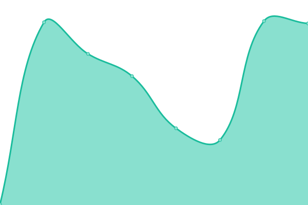
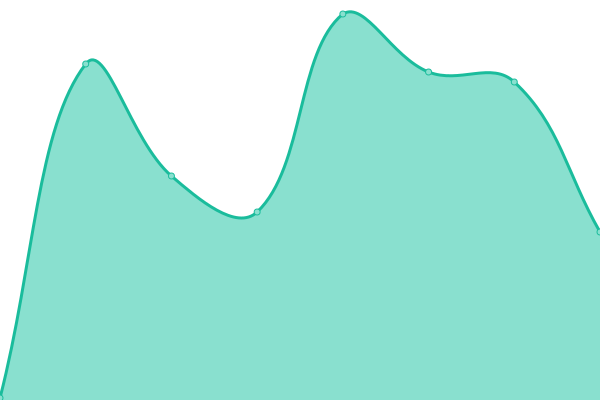
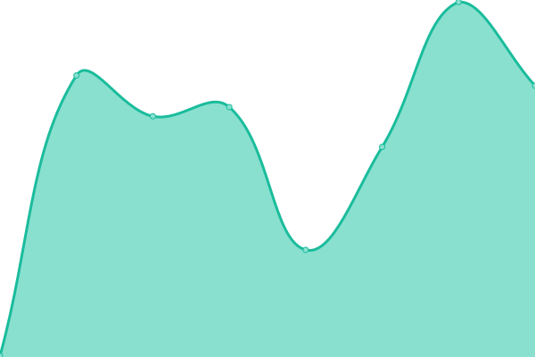
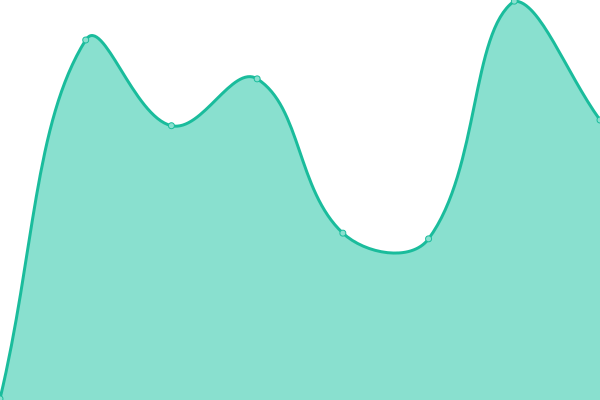

# [📈 Live Status](https://status.adamanteye.cc): <!--live status--> **🟩 All systems operational**

This repository contains the open-source uptime monitor and status page for [adamanteye](note.adamanteye.cc), powered by [Upptime](https://github.com/upptime/upptime).

With [Upptime](https://upptime.js.org), you can get your own unlimited and free uptime monitor and status page, powered entirely by a GitHub repository. We use [Issues](https://github.com/adamanteye/upptime/issues) as incident reports, [Actions](https://github.com/adamanteye/upptime/actions) as uptime monitors, and [Pages](https://status.adamanteye.cc) for the status page.

<!--start: status pages-->
<!-- This summary is generated by Upptime (https://github.com/upptime/upptime) -->
<!-- Do not edit this manually, your changes will be overwritten -->
<!-- prettier-ignore -->
| URL | Status | History | Response Time | Uptime |
| --- | ------ | ------- | ------------- | ------ |
|  [Note](https://note.adamanteye.cc) | 🟩 Up | [note.yml](https://github.com/adamanteye/upptime/commits/HEAD/history/note.yml) | 

 200ms
     
 | 

<a href="https://status.adamanteye.cc/history/note">100.00%</a>
    

|  [Pastebin](https://bin.adamanteye.cc) | 🟩 Up | [pastebin.yml](https://github.com/adamanteye/upptime/commits/HEAD/history/pastebin.yml) | 

 152ms
     
 | 

<a href="https://status.adamanteye.cc/history/pastebin">100.00%</a>
    

|  [WakaTime](https://wakatime.adamanteye.cc) | 🟩 Up | [waka-time.yml](https://github.com/adamanteye/upptime/commits/HEAD/history/waka-time.yml) | 

 202ms
     
 | 

<a href="https://status.adamanteye.cc/history/waka-time">100.00%</a>
    

|  [Hedgedoc](https://doc.adamanteye.cc) | 🟩 Up | [hedgedoc.yml](https://github.com/adamanteye/upptime/commits/HEAD/history/hedgedoc.yml) | 

 222ms
     
 | 

<a href="https://status.adamanteye.cc/history/hedgedoc">100.00%</a>
    

|  [Taskchampion Sync Server](https://task.adamanteye.cc) | 🟩 Up | [taskchampion-sync-server.yml](https://github.com/adamanteye/upptime/commits/HEAD/history/taskchampion-sync-server.yml) | 

 238ms
     
 | 

<a href="https://status.adamanteye.cc/history/taskchampion-sync-server">100.00%</a>
    

|  [GPG Static File Server](https://gpg.adamanteye.cc) | 🟩 Up | [gpg-static-file-server.yml](https://github.com/adamanteye/upptime/commits/HEAD/history/gpg-static-file-server.yml) | 

 221ms
     
 | 

<a href="https://status.adamanteye.cc/history/gpg-static-file-server">100.00%</a>
    

<!--end: status pages-->

[**Visit our status website →**](https://status.adamanteye.cc)

## 📄 License

- Powered by: [Upptime](https://github.com/upptime/upptime)
- Code: [MIT](./LICENSE) © [Anand Chowdhary](https://anandchowdhary.com), supported by [Pabio](https://pabio.com)
- Data in the `./history` directory: [Open Database License](https://opendatacommons.org/licenses/odbl/1-0/)
